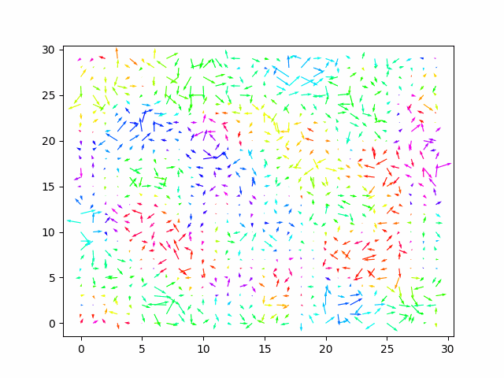
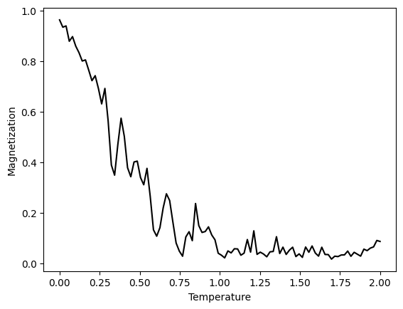

# 2D Magnetic Dipole Lattice

 

This is a simulation of magnetic dipoles on a 2D lattice. Similar to the XY model, the magnets have a fixed magnetic moment, are free to rotate, and interact with their neighbors with a potential proportional to the cosine of the angle between them.

The difference is that this simulation is not calculated by sampling from a distribution, but assumes that the magnets have angular mass, treating the temperature as the average rotational energy of the magnets. Verlet integration is used to calculate the motion of the magnets, and a Nosé thermostat is used to keep the temperature constant.

In the above GIF, the magnets are randomly initialized and have periodic boundary conditions. The temperature then decreases to zero, and the magnets align. When the temperature increases again, the emergence of magnetic domains can be observed.

To calculate the local average of the magnetization, the grid is convolved with a constant kernel. The angle of the local magnetization determines the color of the arrow, and the length of the arrow is proportional to the magnitude of the local magnetization.

When plotting the average total magnetization over the temperature, a phase transition can be observed.
