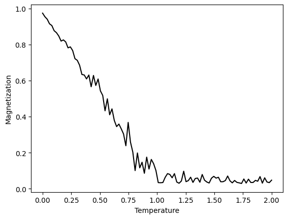

# 2D Magnetic Dipole Lattice

This is a simulation of magnetic dipoles on a 2D lattice. The magnets have a fixed magnetic moment, are free to rotate, and interact with their direct neighbors by a potential proportional to the cosine of the angle between them and with periodic boundary conditions at the edges. The magnets are assumed to have angular mass, treating the temperature as the average rotational energy of the magnets. Verlet integration is used to calculate the motion of the magnets, and a Nosé thermostat is used to keep the temperature constant. A more detailed description of the simulation can be found in [notebooks/magnetic_dipole_lattice.ipynb](notebooks/magnetic_dipole_lattice.ipynb).

 

In the above GIF, the magnets are randomly initialized. The temperature then decreases to zero, the magnets align and the temperature increases again. At low temperatures, the emergence of magnetic domains can be observed.

The colors of the arrows represent the angle of the local magnetization. The length of the arrows is proportional to the magnitude of the local magnetization. To calculate the local average of the magnetization, the lattice is convolved with a constant, normalized 5x5 kernel.

When plotting the total magnetization over the temperature, a phase transition can be observed.

When plotting the total magnetization over an applied magnetic field, a hysteresis loop can be observed.

